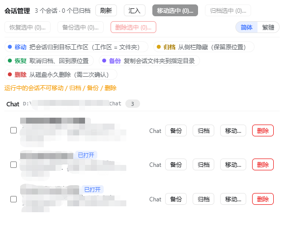
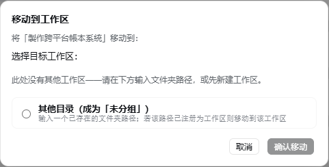
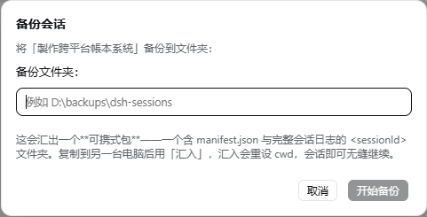
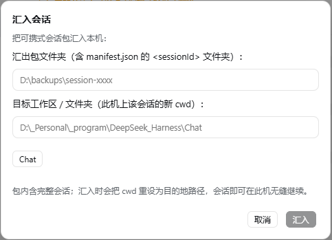
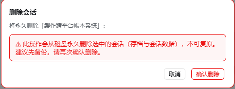

# dsh-session-mgr

**Session Manager for the DeepSeek Harness Web UI**

Move, archive, restore, backup and delete conversations — including archived ones — across workspaces, right from the Settings page.

[**简体中文**](README.zh-CN.md) · [](LICENSE) · 

---

## Table of Contents

- [Features](#features)
- [Screenshots](#screenshots)
- [Requirements](#requirements)
- [Installation](#installation)
- [Usage](#usage)
- [HTTP API](#http-api)
- [How It Works](#how-it-works)
- [Safety](#safety)
- [Development](#development)
- [License](#license)

---

## Features

| Feature | Description |
|---|---|
| **Move** | Relocate any conversation (including archived ones) to any workspace. |
| **Archive** | Hide a conversation from the sidebar; its workspace position and order are kept. |
| **Restore** | Un-archive a conversation back to its original place. |
| **Backup / Export** | Produce a **portable package** — a `<sessionId>` folder with a `manifest.json` and the full session log. Transfer it to another machine and **Import** there to resume the conversation seamlessly. |
| **Import** | Install a portable package on this machine, rewriting the session `cwd` to a workspace/folder that exists here — so a conversation started on another machine continues here. |
| **Delete** | Permanently erase a conversation from disk, behind a red **double-confirm** dialog. |
| **Trilingual UI** | English / 简体中文 / 繁體中文 — follows the harness language setting; the 简体/繁體 switch lives inside the plugin page. |
| **Header quick action** | "Move to Workspace" for the currently open conversation. |

Both **per-row** and **batch** operations are supported (move / archive / restore / backup / delete selected).

### Cross-machine portability

A session belongs to a workspace through its header `cwd` — an absolute path that is machine-specific. So a plain folder copy would break on another machine (the path no longer exists). Instead:

1. On machine A: **Backup** a session → you get a portable package.
2. Copy that package to machine B.
3. On machine B: **Import** the package and pick the workspace/folder where the session should live → the import rewrites the `cwd` to B's path (the conversation content is untouched), and the session resumes seamlessly on B.

> 中文说明：工作区 = 文件夹，会通过 header 的 `cwd` 关联，而 `cwd` 是每台机器专属的绝对路径。因此 A 机备份的会话要搬到 B 机继续，需要用「汇入」把 `cwd` 重设为 B 机上存在的路径。

## Screenshots

**Session Manager page**



**Dialogs**

| Move to Workspace | Backup / Export | Import | Delete (double-confirm) |
|---|---|---|---|
|  |  |  |  |

## Requirements

- [DeepSeek Harness](https://github.com/deepseek-ai/deepseek-harness) with the **web** profile (`dsh web`)
- Node.js `^22.19.0 || >=24.0.0` (the harness runtime)

## Installation

### Method 1 — install into the web profile (recommended)

```sh
# 1. Clone / download this repo, then install it into your web profile.
#    Replace <path> with the absolute path of the dsh-session-mgr folder.
dsh plugin --profile web add "file:<path>\dsh-session-mgr"

# 2. Add the bundle to your web profile's package.json
#    (the `dsh.profile.bundles` array, alongside the other plugin entries):
#    "dsh-session-mgr"

# 3. Restart the web server for the plugin to load.
dsh web
```

### Method 2 — manual

Put the package into your profile's `node_modules` (e.g. `pnpm add file:...` or a symlink), then add `"dsh-session-mgr"` to the `dsh.profile.bundles` list in the profile's `package.json`, and restart.

## Usage

1. Open **Settings → Session Manager**.
2. All conversations are grouped by their current workspace; archived ones carry a badge.
3. Use the per-row buttons, or tick the checkboxes and use the batch toolbar:

   - **Move selected…** → pick a destination workspace (or type any existing folder to make it "Ungrouped").
   - **Archive selected…** → hide them from the sidebar (position kept).
   - **Restore selected…** → un-archive them back to their place.
   - **Backup selected…** → export each session as a **portable package** (an `<id>` folder with `manifest.json` and the full log) to a folder you choose.
   - **Import…** → install a portable package from another machine into a chosen workspace/folder (safe to run on machine B).
   - **Delete selected…** (red) → a red warning dialog asks you to **confirm again** before anything is erased.

4. While a conversation is open, the header also shows **Move to Workspace** to relocate it in one click.
5. Use the **简体/繁體** switch in the toolbar (shown when the harness language is Chinese) to toggle the Chinese script.

## HTTP API

The host half exposes a small JSON API under `/dsh-session-mgr/*` (all `POST`):

| Endpoint | Request | Response |
|---|---|---|
| `/dsh-session-mgr/list` | `{}` | `{ workspaces, sessions, archivedSessionIds, backupDefaultDir }` |
| `/dsh-session-mgr/move` | `{ sessionId, targetPath }` | `{ ok, sessionId, archived, from, to }` |
| `/dsh-session-mgr/archive` | `{ sessionId }` | `{ ok, archived, sessionId, archivedSessionIds }` |
| `/dsh-session-mgr/unarchive` | `{ sessionId }` | `{ ok, archived, sessionId, changed, archivedSessionIds }` |
| `/dsh-session-mgr/backup` | `{ sessionId, targetDir }` | `{ ok, sessionId, cwd, archived, backupPath, sizeBytes, manifest }` |
| `/dsh-session-mgr/import` | `{ sourceDir, targetPath }` | `{ ok, sessionId, importPath, cwd, workspaceId?, workspaceTitle? }` |
| `/dsh-session-mgr/delete` | `{ sessionId }` | `{ ok, sessionId, deleted, reason?, path, sizeBytes?, cwd? }` |

`targetPath` accepts either a real directory path or a registered workspace id. `backup` produces the portable package; `import` installs it on this machine (remapping `cwd` to `targetPath`).

## How It Works

In DeepSeek Harness a **workspace is a folder**: a session belongs to a workspace through its session header `cwd`. "Moving" a session therefore:

1. moves the session artifact folder from `<sessions>/<encoded-old-cwd>/<id>` to `<sessions>/<encoded-new-cwd>/<id>`;
2. rewrites the `cwd` field of the JSONL log header (the first zstd frame);
3. updates the in-memory workspace registry so the sidebar regroups immediately — **no restart needed**.

Archive/unarchive uses the registry-global archive set; an archived session keeps its `sessionIds` slot, so restoring puts it back exactly where it was.

## Safety

- **Running** sessions cannot be moved / archived / backed up / deleted (checked via the `agents` service).
- Idle live sessions are evicted from memory before a move/delete so the next open reads the new header.
- Existing files/folders with the same name at the destination are **refused** (no silent overwrite).
- Cross-volume (EXDEV) moves fall back to copy + delete source.
- Delete requires a **double confirmation** and is irreversible — a backup is recommended.

## Development

The pure helpers in `lib/host.js` (path encoding, zstd frame scan, header rewrite, folder move) are unit-testable:

```sh
node scripts/test-move.mjs   # synthetic-data tests
node scripts/test-real.mjs   # tests against a COPY of a real session
```
`test-real.mjs` needs a real session dir as its argument (or `DSH_REAL_SAMPLE`):
```sh
node scripts/test-real.mjs "C:\path\to\<session-id>\"
```

## Contributing

Found a bug or want a feature? Open an [issue](../../issues) or a pull request. Please keep the code style (plain ESM, no build step) and add/run tests for any change to `lib/host.js`.

## License

[MIT](LICENSE)
